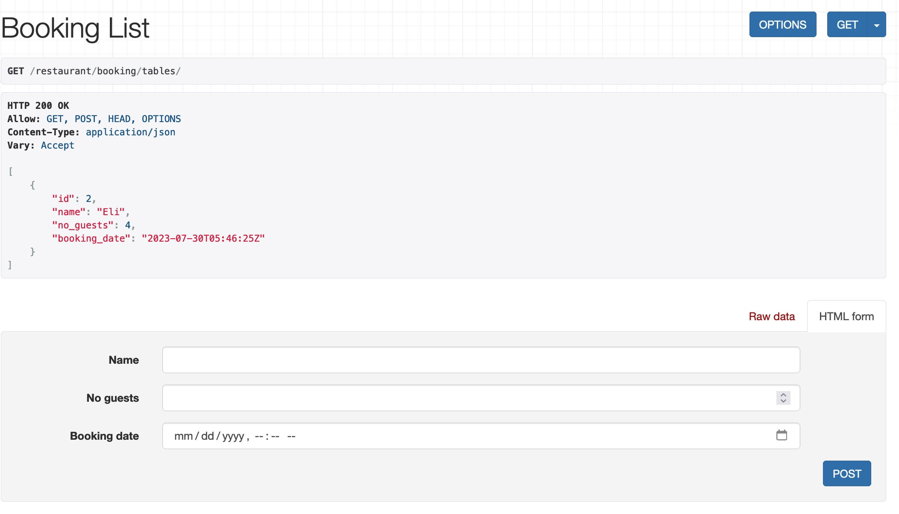
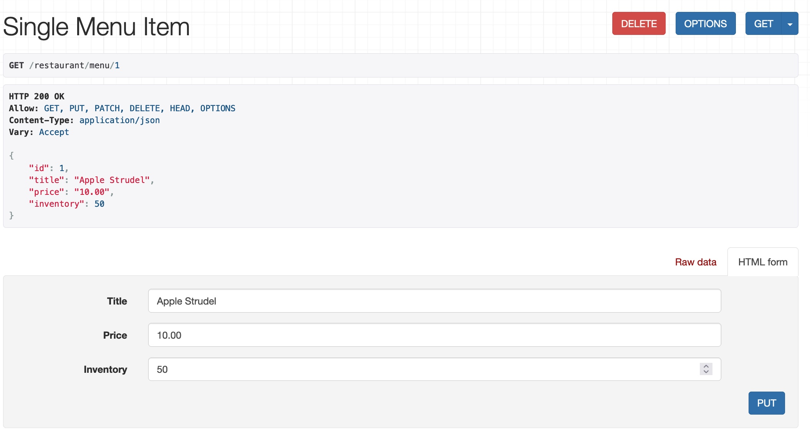
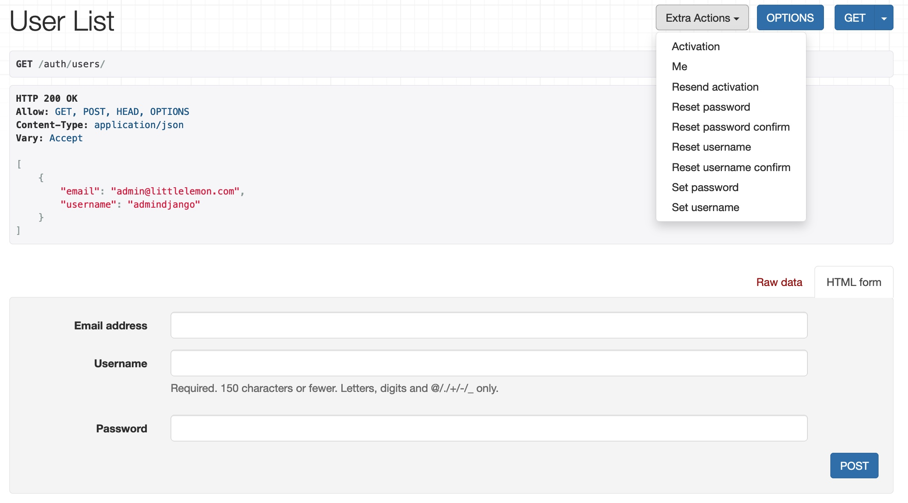
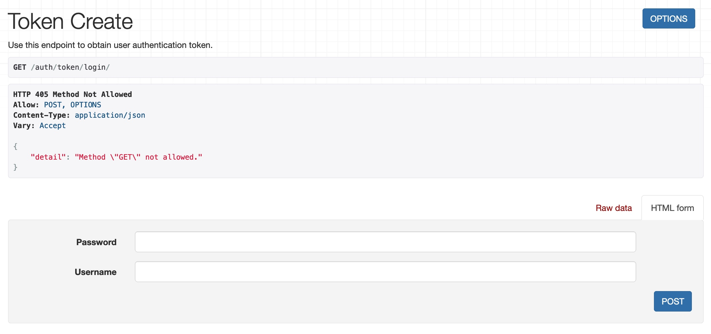

## Meta Back-End Developer Capstone Project

Menu and Table Booking APIs using the Django Rest Framework.

**Menu items**
   

**Single item**
   

**Booking list**
   

**User registration**
   

**User authentication token**

